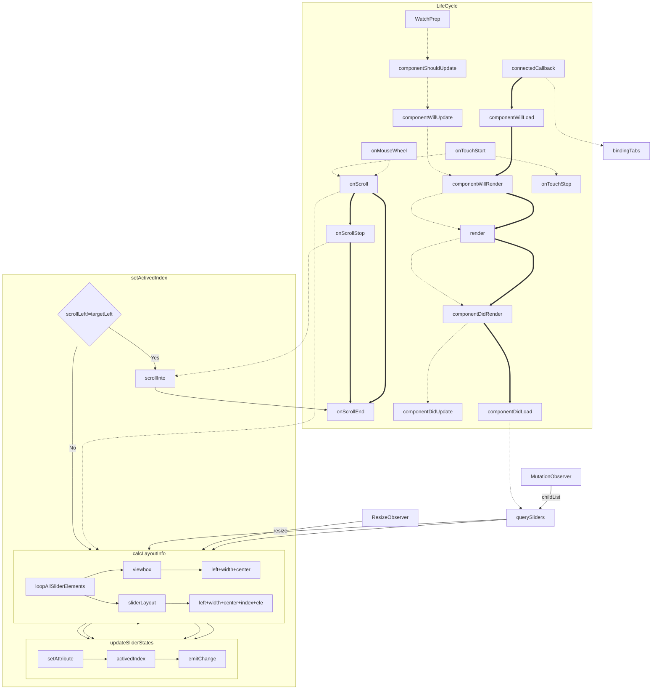

```mermaid
flowchart TD
    connectedCallback -...-> bindingTabs
    MutationObserver -->|childList| querySliders --> calcLayoutInfo --> updateSliderStates
    ResizeObserver -->|resize| calcLayoutInfo --> updateSliderStates
    componentDidLoad -...-> querySliders  --> calcLayoutInfo --> setActivedIndex


    onScroll -...-> calcLayoutInfo --> updateSliderStates
    onScrollStop -...-> scrollInto --> onScrollEnd

    subgraph setActivedIndex
    canScroll{scrollLeft!=targetLeft} -->|Yes|scrollInto
    canScroll -->|No| calcLayoutInfo --> updateSliderStates
    end

    subgraph calcLayoutInfo
    loopAllSliderElements --> viewbox --> left+width+center
    loopAllSliderElements --> sliderLayout --> left+width+center+index+ele
    end

    subgraph updateSliderStates
    setAttribute --> activedIndex --> emitChange
    end

    subgraph LifeCycle
    connectedCallback ===> componentWillLoad ===> componentWillRender ===> render ===> componentDidRender ===> componentDidLoad
    WatchProp -..-> componentShouldUpdate -..-> componentWillUpdate -..-> componentWillRender -..-> render -..-> componentDidRender -..-> componentDidUpdate
    onScroll ===> onScrollEnd
    onScroll ===> onScrollStop ===> onScrollEnd
    onMouseWheel -.-> onScroll
    onTouchStart -.-> onScroll
    onTouchStart -.-> onTouchStop
    end
```
