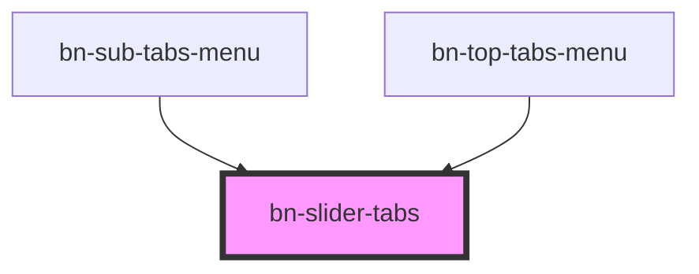

# bn-slider-scrollbar

<!-- Auto Generated Below -->

## Properties

| Property              | Attribute               | Description                  | Type                  | Default     |
| --------------------- | ----------------------- | ---------------------------- | --------------------- | ----------- |
| `activedIndex`        | `actived-index`         |                              | `number \| undefined` | `undefined` |
| `defaultActivedIndex` | `default-actived-index` |                              | `number \| undefined` | `undefined` |
| `forSlider`           | `for-slider`            | the `<bn-slider>` element id | `string \| undefined` | `undefined` |
| `forTabs`             | `for-tabs`              |                              | `string \| undefined` | `undefined` |

## Events

| Event                | Description                    | Type                                                                                                                                     |
| -------------------- | ------------------------------ | ---------------------------------------------------------------------------------------------------------------------------------------- |
| `activedIndexChange` |                                | `CustomEvent<number>`                                                                                                                    |
| `activedTabChange`   |                                | `CustomEvent<[tabEle: HTMLElement \| undefined, index: number]>`                                                                         |
| `layoutChange`       | 提供基础的布局信息，虽然自己不用，但是方便外部开发相关的组件 | `CustomEvent<{ box: { viewSize: number; contentSize: number; scrolledSize: number; }; blockList: { size: number; start: number; }[]; }>` |

## Methods

### `bindSliderElement(_sliderEle?: HTMLElement | null | undefined) => Promise<void>`

手动绑定或者解绑 for 元素
从而让 `<bn-slider>` 元素能主动 根据自己的生命周期来与 tabs 进行绑定联动

#### Returns

Type: `Promise<void>`

### `getActivedIndex() => Promise<number>`

#### Returns

Type: `Promise<number>`

### `getLayoutInfo() => Promise<{ box: { viewOffsetLeft: number; viewOffsetWidth: number; viewSize: number; scrolledSize: number; contentSize: number; }; blockList: $Tab[]; activedIndex: number; activedTab: $Tab | undefined; }>`

#### Returns

Type: `Promise<{ box: { viewOffsetLeft: number; viewOffsetWidth: number; viewSize: number; scrolledSize: number; contentSize: number; }; blockList: $Tab[]; activedIndex: number; activedTab: $Tab | undefined; }>`

### `getReason() => Promise<"auto" | "user">`

#### Returns

Type: `Promise<"auto" | "user">`

### `getScrollProgress() => Promise<number>`

#### Returns

Type: `Promise<number>`

### `slideTo(activedIndex: number) => Promise<void>`

#### Returns

Type: `Promise<void>`

## Dependencies

### Used by

 - [bn-sub-tabs-menu](../menu)
 - [bn-top-tabs-menu](../menu)

### Graph

----------------------------------------------

Copyright (c) BFChain
