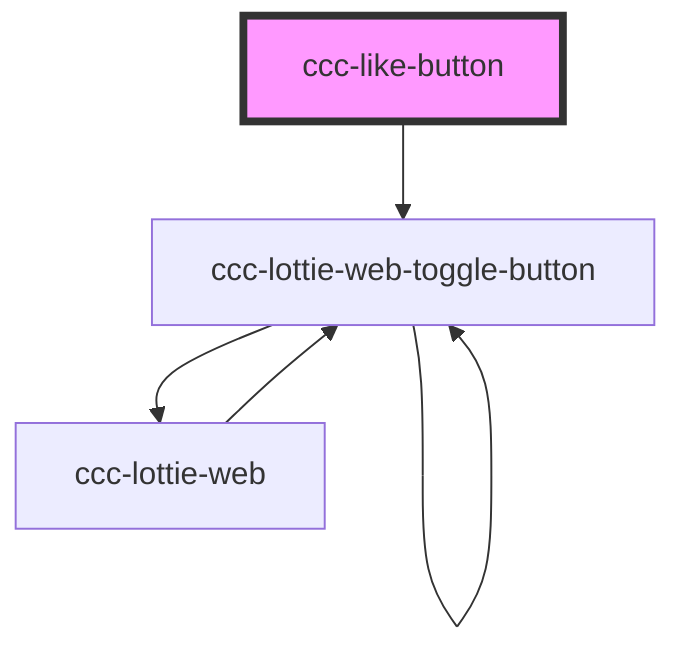

# ccc-button-collect

<!-- Auto Generated Below -->

## Properties

| Property    | Attribute   | Description | Type           | Default |
| ----------- | ----------- | ----------- | -------------- | ------- |
| `checked`   | `checked`   |             | `boolean`      | `false` |
| `count`     | `count`     |             | `number`       | `0`     |
| `direction` | `direction` |             | `"lr" \| "tb"` | `"lr"`  |
| `disabled`  | `disabled`  |             | `boolean`      | `false` |
| `icononly`  | `icononly`  |             | `boolean`      | `false` |

## Dependencies

### Depends on

- [ccc-lottie-web-toggle-button](../lottie-web)

### Graph

----------------------------------------------

Copyright (c) BFChain
