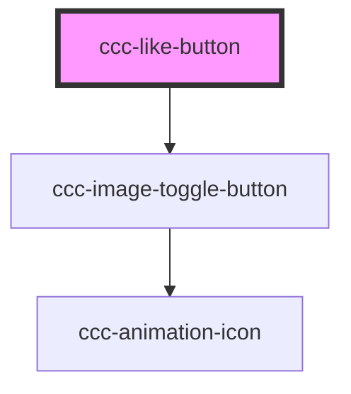

# ccc-button-collect

<!-- Auto Generated Below -->

## Properties

| Property    | Attribute   | Description | Type                 | Default   |
| ----------- | ----------- | ----------- | -------------------- | --------- |
| `checked`   | `checked`   |             | `boolean`            | `false`   |
| `color`     | `color`     |             | `"black" \| "white"` | `"black"` |
| `count`     | `count`     |             | `number`             | `0`       |
| `direction` | `direction` |             | `"lr" \| "tb"`       | `"lr"`    |
| `disabled`  | `disabled`  |             | `boolean`            | `false`   |
| `icononly`  | `icononly`  |             | `boolean`            | `false`   |

## Dependencies

### Depends on

- [ccc-image-toggle-button](../util)

### Graph

----------------------------------------------

Copyright (c) BFChain
