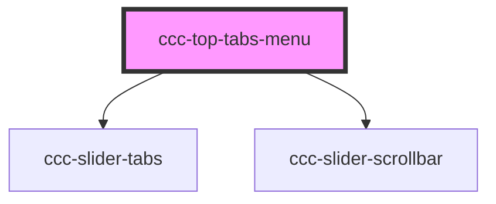

# ccc-sub-tabs-menu

<!-- Auto Generated Below -->

## Properties

| Property    | Attribute    | Description      | Type                  | Default     |
| ----------- | ------------ | ---------------- | --------------------- | ----------- |
| `forSlider` | `for-slider` | 通过 `@Prop` 修饰器绑定 | `string \| undefined` | `undefined` |

## Methods

### `bindSliderElement(ele?: HTMLElement | null | undefined) => Promise<void>`

#### Returns

Type: `Promise<void>`

## Shadow Parts

| Part          | Description |
| ------------- | ----------- |
| `"scrollbar"` |             |
| `"tabs"`      |             |

## Dependencies

### Depends on

- [ccc-slider-tabs](../slider)
- [ccc-slider-scrollbar](../slider)

### Graph

----------------------------------------------

Copyright (c) BFChain
