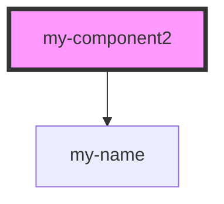

# my-component

<!-- Auto Generated Below -->

## Properties

| Property  | Attribute  | Description     | Type     | Default     |
| --------- | ---------- | --------------- | -------- | ----------- |
| `first2`  | `first-2`  | The first name  | `string` | `undefined` |
| `last2`   | `last-2`   | The last name   | `string` | `undefined` |
| `middle2` | `middle-2` | The middle name | `string` | `undefined` |

## Events

| Event    | Description   | Type                  |
| -------- | ------------- | --------------------- |
| `named2` | name changed! | `CustomEvent<string>` |

## Dependencies

### Depends on

- [my-name](../my-name)

### Graph

----------------------------------------------

Copyright (c) BFChain
