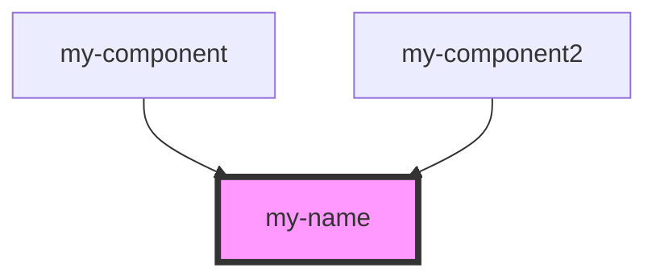

# my-name

<!-- Auto Generated Below -->

## Dependencies

### Used by

 - [my-component](../my-component)
 - [my-component2](../my-component)

### Graph

----------------------------------------------

Copyright (c) BFChain
