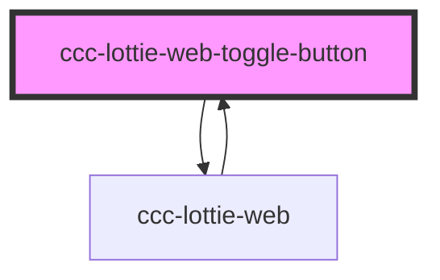

# ccc-lottie-web

<!-- Auto Generated Below -->

## Properties

| Property        | Attribute     | Description | Type                  | Default     |
| --------------- | ------------- | ----------- | --------------------- | ----------- |
| `animationData` | --            |             | `object \| undefined` | `undefined` |
| `checked`       | `checked`     |             | `boolean`             | `false`     |
| `direction`     | `direction`   |             | `"lr" \| "tb"`        | `"lr"`      |
| `disabled`      | `disabled`    |             | `boolean`             | `false`     |
| `icononly`      | `icononly`    |             | `boolean`             | `false`     |
| `label`         | `label`       |             | `string`              | `""`        |
| `labelColor`    | `label-color` |             | `string`              | `""`        |
| `name`          | `name`        |             | `string`              | `""`        |

## Events

| Event           | Description | Type                   |
| --------------- | ----------- | ---------------------- |
| `checkedChange` |             | `CustomEvent<boolean>` |

## Dependencies

### Used by

 - [ccc-lottie-web](.)

### Depends on

- [ccc-lottie-web](.)

### Graph

----------------------------------------------

Copyright (c) BFChain
